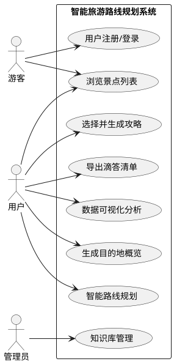
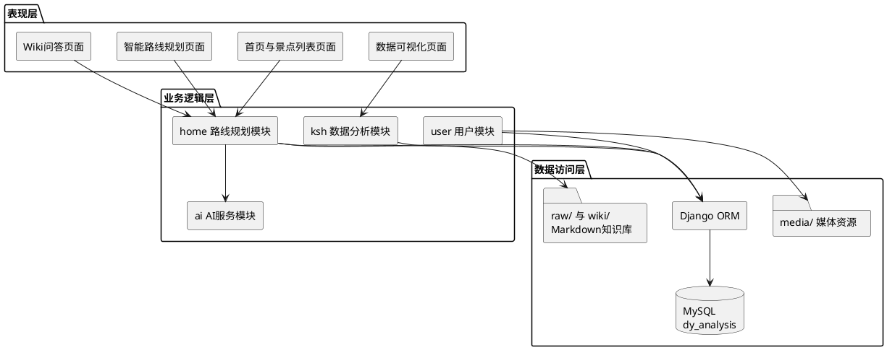
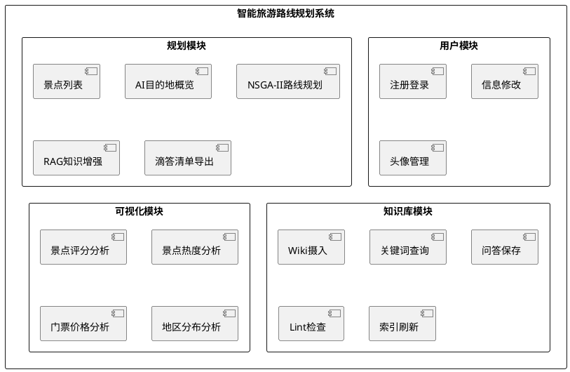
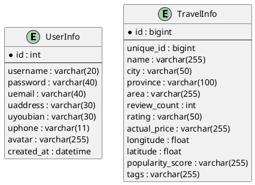

# 第3章 系统需求分析与总体设计

## 3.1 系统需求分析

本章主要围绕智能旅游路线规划系统的实际业务场景，对系统的功能需求、非功能需求以及总体结构进行分析。在前文完成相关技术与理论基础论述之后，本章进一步回答“系统要解决什么问题”“系统应具备哪些能力”以及“系统整体应该如何组织实现”等关键问题。通过需求分析与总体设计，可以为后续系统详细设计、功能实现与测试验证提供明确依据。

本系统面向旅游数据分析与智能路线规划场景，综合采用 Django Web 框架、多目标优化算法、知识增强问答机制以及可视化展示技术，构建一个集数据展示、智能规划、AI 问答和知识管理于一体的旅游辅助决策平台。系统既能够满足普通用户对旅游景点浏览、路线生成和个性化推荐的需求，也能够支持管理员或开发者对知识库进行维护与健康检查，因此具有一定的综合性与实用性。

### 3.1.1 功能需求分析

从使用对象来看，本系统的主要参与者包括游客/普通用户以及管理员两类。其中，游客或普通用户主要关注旅游信息查询、智能路线生成、AI 攻略辅助和可视化分析等功能；管理员则更关注知识库内容的摄入、索引更新、问答结果维护和 Wiki 健康检查等管理类功能。

结合当前项目实现情况，系统的核心功能需求可归纳为以下几个方面。

#### （1）用户注册与登录需求

系统需要提供基础的账号管理功能，包括用户注册、登录、退出以及个人信息修改等。通过用户体系，可以区分不同访问者的身份状态，为后续个性化服务和会话管理提供条件。用户登录后，可以进一步使用路线规划、知识问答、头像修改等需要身份支持的功能。

#### （2）旅游景点浏览与检索需求

用户需要能够浏览系统中采集和整理后的景点信息，包括景点名称、所属省市、评分、热度、价格、标签等字段。系统应支持按关键词搜索、按省份筛选以及分页展示，帮助用户快速缩小查找范围，提高信息获取效率。

#### （3）目的地概览生成需求

在正式制定路线之前，用户通常需要先了解某个城市的整体旅游情况。因此，系统应提供“目的地速览”功能。用户输入目标城市、季节、旅行天数和预算等信息后，系统调用 AI 服务生成该城市的旅游概览，并结合数据库中的景点经纬度信息生成地图点位数据，为用户提供初步认知。

#### （4）智能路线规划需求

这是本系统最核心的功能。用户输入城市、季节、旅行天数、预算以及偏好参数后，系统需要基于同城候选景点集合构建优化问题，并使用 NSGA-II 算法生成多组 Pareto 可行解。随后，系统还应从候选解中筛选出代表性的 Top3 方案，如省钱型、均衡型和体验型，以便用户在多种风格路线中进行选择。

#### （5）AI 攻略生成需求

仅给出路线序列并不能完全满足用户需求，用户往往还希望获得更具可读性的行程描述。因此，系统在用户选定某条推荐路线后，应能够调用 AI 对结果进行自然语言润色，生成结构化旅游攻略说明，包括每日行程安排、景点亮点、交通提示和注意事项等内容，从而提升系统的实用性与交互体验。

#### （6）滴答清单导出需求

为了增强系统结果的可执行性，系统还应支持将规划结果导出为滴答清单任务列表。这样，用户可以将生成的旅游路线进一步转化为待办事项，便于在移动端或实际出行过程中跟踪执行。

#### （7）知识库管理与问答需求

本系统并不只提供数值优化，还融合了旅游知识库能力。系统需要支持对原始 Markdown 资料进行摄入，自动生成摘要页、实体页和概念页；同时应支持基于本地知识库进行查询问答，并在必要时执行知识健康检查，如死链检查、冲突检查和索引刷新等操作。

#### （8）数据可视化分析需求

系统还需具备数据分析与图表展示能力，使用户能够从宏观角度理解旅游数据特征。例如，可对景点评分、热度、票价、区域分布等维度进行可视化展示，从而提升系统的展示性与论文答辩时的演示效果。

基于上述分析，可以将系统的主要用例整理如下。

| 编号 | 用例名称 | 参与者 | 说明 |
|------|----------|--------|------|
| UC01 | 用户注册/登录 | 游客/用户 | 完成账号创建、登录与退出 |
| UC02 | 浏览景点列表 | 游客/用户 | 支持分页、筛选与搜索 |
| UC03 | 生成目的地概览 | 用户 | 调用 AI 生成城市旅游速览 |
| UC04 | 智能路线规划 | 用户 | 输入城市、季节、天数、预算并返回 Top3 方案 |
| UC05 | 选择并生成攻略 | 用户 | 选择某一方案后生成 AI 润色攻略 |
| UC06 | 导出滴答清单 | 用户 | 将旅游行程导出为待办任务 |
| UC07 | 知识库管理 | 管理员 | 完成 Wiki 摄入、查询、Lint 检查与索引刷新 |
| UC08 | 数据可视化 | 用户 | 查看评分、热度、票价、区域分布等图表 |

### 3.1.2 用例图

为了更直观地表达系统参与者与功能之间的关系，下面给出本系统的 UML 用例图 PlantUML 代码。你可以直接将其导入支持 PlantUML 的工具，或者根据该结构在 draw.io 中手工绘制。



### 3.1.3 非功能需求分析

除功能需求外，系统还应满足一定的非功能需求，以保证其在可用性、稳定性和可维护性方面达到毕业设计系统应有的水平。

#### （1）性能需求

系统中的普通数据查询、分页展示和图表渲染应保持较快响应速度。尤其是在智能路线规划模块中，算法计算、候选方案生成和 AI 调用共同决定了系统响应效率。对于用户交互体验而言，路线规划的主要结果返回时间应尽可能控制在 5 秒左右，至少要保证在常规数据规模下具有可接受的等待时间。

#### （2）可用性需求

系统采用 Web 形式实现，应能够在主流浏览器环境下正常访问与使用。页面布局要尽量简洁直观，重要操作流程清晰，避免用户在使用智能规划与知识问答时产生较高学习成本。对于论文答辩场景来说，界面的完整性和演示流畅性也属于可用性的重要体现。

#### （3）可扩展性需求

旅游数据具有持续增长的可能，系统应能够支持后续新增城市、景点和原始攻略文档。例如，当系统引入新的城市景点数据时，应尽量不需要重构已有核心代码；当知识库扩展更多 Markdown 原始材料时，应可以沿用既有 Wiki 摄入流程完成增量更新。

#### （4）可靠性需求

系统需要保证关键功能在合理输入条件下稳定运行。对于多目标优化模块，应能够在景点数据不完整、预算为空或候选点不足时给出合理处理；对于 Wiki 模块，应能够在原始文档缺失、知识页缺漏等情况下维持基本运行能力。同时，系统采用缓存机制避免重复计算，以提高重复请求时的稳定性和响应效率。

#### （5）可维护性需求

本系统作为毕业设计项目，不仅要“能运行”，还要“容易讲清楚、容易修改”。因此系统在结构上应尽量保持模块划分清晰，代码职责明确，便于后续调试、扩展和论文撰写。Django 的多应用组织方式以及 Wiki 模块的目录化知识管理，都有助于提升系统可维护性。

---

## 3.2 系统总体架构设计

在明确系统需求之后，需要进一步从全局层面设计系统的技术组织方式。本系统采用较为典型的分层式架构，并结合 Django 多应用开发模式，将功能划分为用户管理、路线规划、知识管理和数据可视化等多个子模块。总体上看，系统从下到上可分为表现层、业务逻辑层和数据访问层三个层次。

### 3.2.1 分层架构设计

#### （1）表现层

表现层主要负责用户界面展示与交互，包括 HTML 页面模板、CSS 样式、JavaScript 动态逻辑以及图表渲染等。用户通过浏览器访问系统后，首先接触的是表现层内容。系统首页展示统计卡片和基础看板，旅游列表页展示景点分页数据，智能出行页提供输入表单、规划结果和 AI 返回内容，数据分析模块则通过图表方式呈现景点评分、热度和区域分布等信息。

#### （2）业务逻辑层

业务逻辑层是系统的核心层，主要负责处理用户请求、调用算法、组织数据和返回结果。本系统中，业务逻辑层由多个 Django 应用协同构成。`user` 模块负责注册登录和用户资料维护；`home` 模块负责首页展示、景点列表、AI 目的地概览、NSGA-II 路线规划、滴答清单导出以及 Wiki 能力整合；`ksh` 模块负责旅游数据分析与可视化页面；`ai` 模块则封装了大模型调用与文本生成相关逻辑。

#### （3）数据访问层

数据访问层主要负责底层数据存储与读写。本系统的数据来源并不单一，而是同时包含结构化数据库与非结构化本地文件。结构化部分主要为 MySQL 数据库中的景点信息和用户信息；非结构化部分主要包括 `raw/`、`wiki/` 等目录中的 Markdown 文档和知识页面；此外，系统还会使用本地 SQLite 或媒体目录保存部分运行文件和用户头像资源。通过 Django ORM 和文件系统访问接口，系统能够统一完成不同来源数据的读取与使用。

根据上述设计，可以将系统总体分层结构概括如下：

```text
表现层（Presentation Layer）
    ├── HTML模板
    ├── CSS/JavaScript 交互界面
    └── ECharts/页面可视化展示

业务逻辑层（Business Logic Layer）
    ├── 用户管理模块（user）
    ├── 路线规划模块（home）
    ├── 数据分析模块（ksh）
    └── AI服务模块（ai）

数据访问层（Data Access Layer）
    ├── Django ORM
    ├── MySQL（dy_analysis）
    ├── 本地文件系统（raw/、wiki/）
    └── 媒体资源与缓存数据
```

### 3.2.2 系统分层架构图



### 3.2.3 系统功能模块划分

结合当前项目代码结构，可以将系统划分为四类核心功能模块：用户模块、规划模块、知识库模块和可视化模块。

#### （1）用户模块

用户模块主要由 `user` 应用承担，负责实现用户注册、登录、退出、个人信息修改、头像维护等功能。该模块是系统的基础支撑模块，为个性化服务提供身份前提。

#### （2）规划模块

规划模块主要由 `home` 应用承担，是系统最核心的业务模块。它不仅负责景点列表展示和首页统计，还承担目的地概览生成、NSGA-II 路线规划、方案选择、AI 攻略润色、滴答清单导出等关键功能，是整个系统智能化能力最集中的部分。

#### （3）知识库模块

知识库模块依托本地 Markdown Wiki 实现。系统通过读取 `raw/` 目录下的原始资料，自动生成摘要页、实体页和概念页，并支持 Wiki 查询、摄入、索引刷新和 Lint 检查等操作。该模块提升了系统在事实支撑、知识复用与问答解释性方面的能力。

#### （4）可视化模块

可视化模块主要由 `ksh` 应用实现，负责从不同角度展示旅游数据的统计结果，包括景点评分信息、景点热度分析、门票价格分析和景点地区分布等内容。该模块增强了系统的数据表达能力，也有助于在论文中体现“分析系统”特征。

系统模块结构可用下图表示：



---

## 3.3 数据库设计

数据库设计是系统总体设计的重要组成部分。虽然本系统同时使用数据库与本地文件知识库，但结构化数据仍然主要依赖关系型数据库进行组织和管理。根据当前项目实现，系统中的核心数据库实体主要包括景点信息实体和用户信息实体。

### 3.3.1 景点信息表设计

景点信息表是系统最关键的数据表之一，对应项目中的 `TravelInfo` 模型。该表主要存储景点基础信息、评分信息、价格信息、地理信息及热度信息等内容，为旅游列表展示、首页统计、智能路线规划和数据可视化分析提供数据支撑。

结合当前模型定义，可以将景点信息表的主要字段整理如下。

| 字段名 | 类型 | 说明 |
|--------|------|------|
| id | BIGINT | 主键 |
| unique_id | BIGINT | 外部数据唯一标识 |
| name | VARCHAR(255) | 景点名称 |
| city | VARCHAR(50) | 所属城市 |
| province | VARCHAR(100) | 所属省份 |
| area | VARCHAR(255) | 所在区域 |
| review_count | INT | 评论数量 |
| rating | VARCHAR(50) | 评分 |
| actual_price | VARCHAR(255) | 实际票价 |
| market_price | VARCHAR(255) | 市场票价 |
| discount_price | VARCHAR(255) | 优惠价格 |
| tags | VARCHAR(255) | 标签 |
| longitude | FLOAT | 经度 |
| latitude | FLOAT | 纬度 |
| popularity_score | VARCHAR(255) | 热度评分 |
| distance_from_center | VARCHAR(255) | 距市中心距离 |
| image_url | VARCHAR(500) | 图片链接 |
| detail_link | VARCHAR(500) | 详情页链接 |

该表中，评分、价格、热度等字段为后续旅游推荐与统计分析提供基础；经纬度和距市中心距离字段则是路线规划模块中的关键输入；标签字段可用于辅助季节匹配、知识抽取和内容增强。

### 3.3.2 用户信息表设计

用户信息表对应项目中的 `UserInfo` 模型，主要用于存储平台用户的账号信息和基础资料，是实现用户登录和个人信息维护功能的重要数据实体。

其主要字段如下表所示。

| 字段名 | 类型 | 说明 |
|--------|------|------|
| id | INT | 主键 |
| username | VARCHAR(20) | 用户名 |
| password | VARCHAR(40) | 密码 |
| uemail | VARCHAR(40) | 邮箱 |
| uaddress | VARCHAR(30) | 地址 |
| uyoubian | VARCHAR(30) | 邮编 |
| uphone | VARCHAR(11) | 手机号 |
| avatar | VARCHAR(255) | 头像路径 |
| created_at | DATETIME | 创建时间 |

通过该表，系统能够实现账号注册、用户登录、信息修改和头像展示等功能，并为首页用户展示和交互提供数据支持。

### 3.3.3 数据库 E-R 图

根据本系统当前实现，用户与景点之间并未设计显式的中间业务表，因此数据库关系较为简单。用户信息实体和景点信息实体分别承担账号管理和旅游业务数据管理职责，共同支撑整个系统运行。下面给出适合论文展示的简化 E-R 图代码。



需要说明的是，虽然数据库层面的显式实体关系较少，但在业务逻辑层中，用户操作会间接关联景点数据、路线规划结果和知识问答内容。因此，从系统整体看，数据库设计虽然简洁，但已经能够满足当前毕业设计规模下的核心功能实现。

---

## 3.4 本章小结

本章围绕智能旅游路线规划系统的建设目标，对系统需求和总体结构进行了分析。首先，从用户视角出发，总结了用户注册登录、景点浏览、目的地概览生成、智能路线规划、AI 攻略生成、滴答清单导出、知识库管理和数据可视化等核心功能需求，并对性能、可用性、可扩展性、可靠性和可维护性等非功能需求进行了说明。其次，结合项目代码结构，给出了系统的分层架构设计和功能模块划分，明确了表现层、业务逻辑层和数据访问层之间的关系。最后，根据当前模型定义对景点信息表和用户信息表进行了数据库设计分析，并给出了适用于论文展示的 E-R 图。上述内容为下一章系统详细设计与实现奠定了基础。
