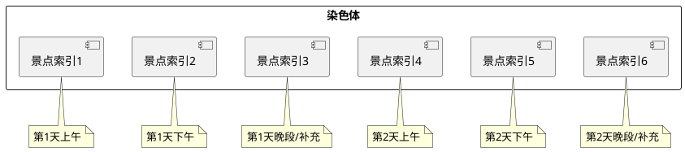
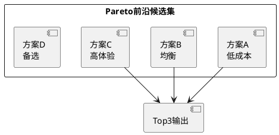

# 第4章 系统详细设计与实现

## 4.1 开发环境

本系统采用 Python 语言作为主要开发语言，结合 Django Web 框架实现后端业务逻辑与页面组织，并通过 MySQL 存储旅游景点与用户信息数据。系统开发与调试环境部署在 Windows 平台上，整体运行方式为典型的 B/S（Browser/Server）架构，用户通过浏览器访问系统页面并完成景点浏览、路线规划、知识问答和数据分析等操作。

从项目当前实现情况来看，系统开发环境主要包括以下内容：

- 操作系统：Windows 10/11
- 开发语言：Python 3.12（运行脚本中使用 `py -3.12` 创建虚拟环境）
- Web 框架：Django 4.2.16
- 数据库：MySQL
- 前端技术：HTML、CSS、JavaScript
- 可视化方式：ECharts + 页面模板渲染
- AI 接口：DeepSeek API（代码中同时使用 `deepseek-chat` 与 `deepseek-v4-flash` 配置）
- 第三方库：pandas、numpy、openai、mysqlclient、PyMySQL 等

系统的基础启动流程较为清晰：首先在项目目录下创建并激活 Python 虚拟环境，然后安装依赖包，最后通过 `python manage.py runserver` 启动 Django 服务。项目中还提供了 `run.bat` 脚本用于简化本地启动操作，有助于提升部署与演示效率。

在项目结构方面，系统采用 Django 多应用组织方式。其中，`user` 应用负责注册登录与用户资料管理，`home` 应用负责首页展示、景点列表、智能路线规划和 Wiki 相关逻辑，`ksh` 应用负责数据可视化页面，`ai` 目录则封装了大模型调用与文本生成逻辑。这种分工明确的工程结构为后续模块化实现提供了良好基础。

---

## 4.2 用户模块设计与实现

用户模块是系统的基础支撑模块，主要承担注册、登录、退出、个人信息维护和头像上传等功能。虽然该模块在算法创新性上不如路线规划模块突出，但它保证了系统具备完整的用户交互闭环，也是系统可用性的重要组成部分。

### 4.2.1 注册与登录流程

在系统使用流程中，用户首先通过注册页面提交用户名、邮箱和密码信息。后端接收到表单数据后，会先检查用户名和邮箱是否已存在，若不存在则创建新的用户记录，并写入用户基础资料。注册完成后，用户即可通过登录页面输入用户名与密码进行身份验证。

登录流程中，后端首先根据用户名查询用户记录；若用户不存在，则直接返回错误提示；若用户存在，则进一步比较用户提交的密码与数据库中存储的密码。当验证通过后，系统会将用户编号、用户名和头像路径写入 Session 中，从而在后续请求中保持登录状态。由于本项目为本科毕业设计，当前实现采用了相对直接的明文比对方式，便于开发与演示，但从工程规范角度看，实际生产环境应进一步采用密码哈希加密存储机制。

### 4.2.2 Session 会话机制

为了实现用户登录后的状态保持，本系统采用 Django 提供的 Session 机制。登录成功后，系统将 `uid`、`uname` 和 `avatar` 等关键信息写入 `request.session`，后续页面在访问时即可直接读取这些字段，从而判断用户是否已登录并显示当前用户信息。例如，在个人信息修改功能中，系统会先从 Session 中读取 `uid`，若不存在则自动重定向到登录页面；在页面模板中，则可以通过 Session 中的用户名和头像路径动态渲染侧边栏用户信息区域。

这种基于 Session 的实现方式结构简单、适配 Django 框架特性，能够满足本科毕业设计规模下的基本需求，也能够体现完整的 Web 身份状态管理逻辑。

### 4.2.3 头像上传与存储

为提升系统交互完整性，本系统还实现了头像上传功能。用户上传头像时，后端首先验证用户登录状态，然后检查请求中是否包含文件对象；若包含文件，则进一步校验文件类型和文件大小，避免不合法资源写入服务器。当前系统支持 JPEG、PNG、GIF 和 WebP 等常见图片格式，并限制单个头像文件大小不超过 2MB。

通过验证后，系统会在 `MEDIA_ROOT/avatars/` 目录下创建头像存储文件，并根据用户编号和时间戳生成唯一文件名。文件保存成功后，系统将头像的相对访问路径写回用户信息表，同时同步更新 Session 中的头像地址，使用户在当前会话中能够立即看到新的头像效果。该设计既体现了 Django 媒体资源处理机制，也增强了系统界面的完整性。

### 4.2.4 用户模块核心代码

下面给出用户登录的核心逻辑片段。该代码体现了用户查询、密码验证以及 Session 写入三个关键步骤。

```python
def login(request):
    if request.method == 'POST':
        username = request.POST.get('username')
        password = request.POST.get('password')
        try:
            user = UserInfo.objects.get(username=username)
        except UserInfo.DoesNotExist:
            return JsonResponse({'code': 400, 'msg': '用户不存在'})

        if password != user.password:
            return JsonResponse({'code': 400, 'msg': '用户名或密码错误'})

        request.session['uid'] = user.id
        request.session['uname'] = user.username
        request.session['avatar'] = user.avatar

        return JsonResponse({'code': 200, 'msg': '登录成功'})
    return render(request, 'login.html')
```

从实现角度看，用户模块虽然逻辑相对基础，但已经具备一个完整 Web 系统所需的最基本账号能力，为首页展示、个人信息维护和智能规划功能调用提供了用户上下文支持。

---

## 4.3 路线规划模块设计与实现

路线规划模块是本系统最核心、最具研究价值的功能模块。该模块不仅涉及旅游景点数据的预处理与清洗，还包括多目标优化模型构建、NSGA-II 算法求解、Top3 路线方案筛选、AI 文本生成、知识增强和外部任务导出等多个环节。相比传统的静态旅游推荐，本系统更强调“数据驱动 + 多目标优化 + AI 辅助解释”的综合实现路径，因此本节也是全文的重点。

### 4.3.1 景点数据预处理

在进行旅游路线规划之前，系统首先需要对原始旅游景点数据进行清洗与标准化处理。项目中的 `data_pro.py` 负责基础 CSV 清洗，其主要任务包括：读取原始 `data.csv` 文件、按“唯一标识”去重、对评分、热度、评论数量等字段进行缺失值填充，并对标签字段中的特殊字符进行清理，最后输出为结构更规整的 `data_pro.csv`。这一过程为后续数据库导入与算法使用提供了较好的数据基础。

在进入路线规划模块后，系统并未直接依赖原始字符串数据，而是进一步在算法实现文件中执行细粒度的数据标准化处理。首先，对于价格字段，系统通过 `_parse_price()` 函数处理“免费”“空值”以及包含中文描述的价格字符串，并借助正则表达式提取其中的数字信息，将其统一转换为非负浮点数，从而保证成本目标的可计算性。

其次，在地理坐标处理方面，系统通过 `_normalize_coord_pair()` 函数对经纬度数据进行归一化。该函数首先将原始经纬度尝试转换为浮点数；若坐标缺失或异常，则直接判定为无效点；若经纬度顺序可能颠倒，则通过中国经纬度边界范围进行反向校验，并在必要时自动交换顺序。这一策略能够有效处理抓取数据中常见的“经纬度反序”问题，并过滤掉明显不在中国范围内的异常点，例如 `(0,0)` 这类无效坐标。

此外，系统还引入了基于季节标签的匹配增强机制。项目定义了春、夏、秋、冬四组关键词，例如春季对应“花、樱、桃、杜鹃、踏青”，夏季对应“漂流、避暑、峡谷、水、海、湖”等。当候选景点标签中命中相应季节关键词时，系统会为景点评分增加一定季节加成，使规划结果更符合用户输入季节的出游偏好。这种处理方式虽然规则较轻量，但在实际旅游推荐场景中具有较强合理性。

### 4.3.2 NSGA-II 算法实现

在数据完成预处理后，系统需要对给定城市中的候选景点集合进行优化求解。考虑到旅游路线规划同时涉及预算控制、路径长度、景点质量与热门程度等多个目标，本系统采用 NSGA-II 算法构建多目标优化求解过程。

#### （1）染色体编码

本系统中的个体采用整数序列编码方式表示，每个基因位置对应一个景点索引。若用户输入旅行天数为 `days`，且系统设定每天最多游玩 `per_day=3` 个景点，则染色体长度可表示为：

\[
n = days \times per\_day
\]

因此，一条染色体可以表示为：

\[
Chromosome = [s_1, s_2, s_3, \ldots, s_n]
\]

其中，\(s_i\) 表示候选景点集合中的第 \(i\) 个景点编号。系统通过 `random.sample()` 在候选景点中随机抽取若干不重复索引，构成初始种群中的一条路线方案。

可用于论文配图的染色体编码示意如下：



#### （2）适应度评估

系统通过 `_evaluate_route()` 对每条路线进行指标计算，主要包括总成本、总路程、平均评分、平均热度以及评论热度对数值等。其中，总成本由各景点门票价格累加得到；总路程由景点间的 Haversine 球面距离与景点距市中心距离共同组成；平均评分和平均热度则分别反映路线整体体验质量与热门程度。

对于可行解与不可行解，系统采用不同的目标构造方式。若一条路线满足预算约束，即：

\[
\sum cost(x_i) \le budget
\]

则其目标向量定义为：

\[
[cost, distance, -rating, -hotness]
\]

若该路线超出预算，则系统不直接删除它，而是对目标函数赋予极大惩罚值，例如将第一目标设置为 `1e9 + penalty`，其余目标也设置为极大值，使其在非支配排序中自然处于劣势。这样既保留了搜索空间完整性，也保证了预算可行解优先进入 Pareto 前沿。

#### （3）遗传操作

在交叉操作中，系统采用有序交叉（Order Crossover, OX）方式生成子代。具体做法是：先从父代 A 中随机选取一个连续片段并复制到子代对应位置，再按照父代 B 中景点出现顺序依次填补剩余空位。这种方式能够在保留父代局部顺序结构的同时，避免产生重复景点。

对应的论文示意图可以表示为：

```plantuml
@startuml
rectangle "父代A" as A {
 [1][2][3][4][5][6]
}
rectangle "父代B" as B {
 [4][6][5][2][1][3]
}
rectangle "子代C" as C {
 [ ][2][3][4][ ][ ]
}
A --> C : 复制中间片段
B --> C : 按顺序填补空位
@enduml
```

在变异操作中，系统同时引入交换变异和替换变异。交换变异通过随机选取两个位置并交换其景点顺序，适合调整局部访问路径；替换变异则从未出现的候选景点中随机选择一个景点替换当前基因位置，以扩大搜索范围。完成变异后，系统调用 `_repair_unique()` 执行唯一性修复，确保路线中不会出现重复景点。

#### （4）Pareto 前沿选择与方案排序

完成多代进化后，系统会通过快速非支配排序提取第一层 Pareto 前沿。Pareto 前沿中的每条路线在多目标意义下都具有一定优越性，但直接返回全部结果既不便于用户选择，也不利于前端展示。因此，本系统进一步设计了 Top3 方案筛选策略。

其中，经济型方案通过 `min(cost)` 选取总花费最低的路线；体验型方案通过最大化 `rating × 0.6 + hotness × 0.4` 选取评分与热度表现最优的路线；均衡型方案则通过 `choose_solution()` 函数，综合用户对价格、距离、热度、评分和避拥挤的敏感度进行加权选择，选出成本、路程和体验更均衡的候选方案。

这种从 Pareto 解集进一步筛选“代表性方案”的做法，使多目标优化结果真正转化为面向用户的可解释推荐输出，也显著提升了系统的交互实用性。

用于论文展示的 Pareto 前沿示意图如下：



### 4.3.3 AI 服务与目的地概览

在传统路线优化结果基础上，本系统进一步引入大语言模型服务，以提升系统在“说明能力”和“交互自然性”方面的表现。AI 服务主要体现在两个方面：一是生成城市目的地概览，二是对优化结果进行文本润色与 HTML 报告生成。

在目的地概览功能中，系统通过 `Get_DeepSeek` 类调用 DeepSeek 接口，并为模型设计了专门的系统提示词。该提示词要求模型不要直接输出具体日程，而是围绕城市概况、可游览类型、注意事项和重点片区进行概括，并严格以 JSON 对象格式返回结果，如 `city_summary`、`what_to_see`、`watchouts` 和 `regions` 等字段。后端在拿到模型输出后，会首先尝试去除代码围栏，再解析为 JSON 结构；若解析失败，则自动进入降级处理，将原始文本节选作为兜底输出，从而保证接口尽可能返回可用结果。

这种“结构化约束 + 异常降级”的实现方式，是大模型在工程落地中非常实用的一种手段。它既发挥了语言模型在内容概括方面的优势，又通过固定字段约束减少了模型输出不稳定对前端解析带来的风险。

### 4.3.4 RAG 知识库增强

为了提升 AI 内容与本地旅游资料的一致性，本系统并未仅依赖通用大模型，而是进一步结合本地 Wiki 知识库实现轻量化 RAG 增强。知识库目录主要包括 `raw/`、`wiki/summary/`、`wiki/entity/` 和 `wiki/concept/` 四类内容。原始攻略存放于 `raw/` 目录中，系统在摄入时会读取原文，通过 LLM 提取摘要、识别实体与概念，并自动生成对应的摘要页、实体页和概念页。

在知识检索阶段，系统会根据当前城市、规划路线中的景点名称以及关键词信息执行匹配，优先召回与路线中景点相关的知识卡片。知识卡片中包含 `best_time`、`booking_tip`、`transport_tip`、`pitfalls`、`crowd_level`、`duration_suggestion` 等字段。随后，这些知识卡片会被拼接进 AI 润色 Prompt 中，使大模型在生成旅游攻略时能够参考本地事实知识，而不是完全依赖参数记忆。

这种设计使系统具备了“规划结果 + 知识解释”的复合能力。例如，系统不仅能告诉用户“去哪”，还能进一步说明“什么时候去更合适”“是否需要预约”“有什么避坑提示”，从而显著提升系统回答质量和可解释性。

### 4.3.5 路线可视化与报告生成

在完成路线求解和 AI 润色后，系统还需要将结果以更直观的方式呈现给用户。为此，本系统在路线结果中保留了每个景点的名称、经纬度、时段、预计花费和特色信息，前端可以基于这些结构化数据进行地图点位渲染和分日展示。虽然当前代码中更强调数据返回与前端可扩展接口设计，但整体结构已经具备接入高德地图、百度地图或其他前端地图组件的条件。

此外，系统还专门生成 HTML 报告文本，用于将路线结果组织为更适合阅读的“旅游报告”形式。报告通常按天分块展示，并可结合预算信息、交通衔接建议、知识提示和应急说明等内容，使结果不再只是简单的景点列表，而是更接近真实旅游攻略。相比完全让 LLM 输出超长 HTML，系统更倾向于“固定模板 + 局部 AI 内容注入”的实现思路，这样能够避免生成内容过长被截断，也有利于保持页面结构稳定。

### 4.3.6 滴答清单导出

为了让规划结果真正服务于实际出行，本系统实现了滴答清单导出功能。该功能通过调用第三方清单 API，将系统中的每日景点安排转换为具体的待办任务。导出时，系统首先解析用户输入的出发日期时间，然后根据景点的 `visit_time` 字段提取“第 X 天”和“上午/中午/下午”等时段信息，进一步推算每个景点任务的开始时间与结束时间。

在字段映射上，系统将“景点名 + 时段”映射为任务标题，将景点特色、预计花费、坐标、最佳时段、预约建议、交通提示和避坑建议等内容整理为任务正文，并写入 `content` 与 `desc` 字段中。随后，系统通过 HTTP POST 请求向滴答清单接口逐条创建任务，并记录成功与失败的任务信息。如果全部任务创建失败，则返回错误提示；若部分或全部创建成功，则向前端返回创建数量与示例结果，便于用户确认导出状态。

这一功能使系统从“推荐路线”进一步延伸到“执行计划”，增强了毕业设计系统的完整性与实用价值。

---

## 4.4 数据分析模块设计与实现

除路线规划外，系统还设计了相对完整的数据分析与可视化模块，以展示旅游景点数据的统计规律。该模块主要由 `ksh` 应用实现，包括景点评分信息、景点热度分析、门票价格分析和区域分布分析等页面。

在门票价格分析页面中，系统并未直接依赖离线统计表，而是优先从 `TravelInfo` 模型中动态读取景点价格信息。对每个景点，系统会优先解析实际票价，若无效则回退至市场票价；若景点为免费类型，则价格记为 0。若用户选择某一省份，则系统进入详情模式，展示该省份各景点的价格分布；若未指定省份，则系统按省份统计景点平均门票价格，从而形成区域层面的价格对比。

在区域分布统计页面中，系统考虑到原始“所在区域”字段可能过细，若直接聚合可能出现大量区域仅对应单个景点、图表失真等问题。因此，系统设计了退化处理策略：若检测到区域聚合过于离散，则自动上卷为按城市聚合；若城市仍不适合作为区分粒度，则进一步尝试从区域文本中抽取区或县信息重新汇总。该策略体现了系统在统计图设计中的鲁棒性考虑。

在热度排行与评论趋势等功能中，系统通过 SQL 查询或 ORM 聚合方式提取统计结果，再交由前端页面使用 ECharts 进行可视化展示。这种“后端组织数据、前端负责渲染”的模式结构清晰，也符合 Django Web 项目常见的技术实现路线。

---

## 4.5 前端界面设计

在前端界面设计方面，本系统采用基于 Django 模板的页面组织方式，并在视觉风格上统一使用玻璃拟态与轻量化卡片设计，以提升界面现代感和展示效果。整体页面结构由顶部导航栏、左侧功能菜单和主内容区组成，不同模块页面通过统一的 `base.html` 模板进行继承，从而保证系统风格一致。

首页主要承担系统看板功能，展示景点总量、城市数量、评论总量、热度排行以及部分统计图表，使用户在进入系统后能够快速理解项目的数据规模和整体情况。路线规划页面则更强调交互流程设计，用户依次完成城市、季节、天数、预算和偏好参数输入，点击生成后获得 Top3 方案，再进一步选择某一方案查看路线详情、AI 报告和知识卡片内容。

在界面交互流程上，系统尽量保持操作链路清晰，形成“填写表单 → 生成方案 → 选择方案 → 查看报告 → 导出滴答清单”的完整闭环。这种流程既符合用户的使用习惯，也便于论文中结合截图说明各页面之间的衔接关系。

同时，前端样式还考虑了响应式布局问题。在小屏幕设备下，侧边栏可以折叠，部分输入区和展示卡片也会自适应排列，从而保证系统在不同浏览器窗口尺寸下具有基本可用性。虽然本项目以桌面浏览器演示为主，但这种设计仍体现了较好的界面工程意识。

### 4.5.1 前端展示截图建议

本节在正式排版时，建议插入以下界面截图，并在正文中按“如图 X-X 所示”进行引用：

1. 系统首页截图
2. 路线规划页面截图
3. Top3 方案对比页面截图
4. AI 报告展示页面截图
5. 滴答导出成功提示截图
6. Wiki 问答页面截图

截图时应注意以下要求：
- 截图分辨率尽量清晰；
- 不要出现真实个人隐私信息；
- 图下方应标注规范图题，如“图4-1 系统首页界面”；
- 若页面过长，可采用局部截图与整体截图结合方式进行展示。

---

## 4.6 本章小结

本章围绕系统的详细设计与实现过程展开论述。首先介绍了系统开发环境与项目组织方式，其次分析了用户模块中注册登录、Session 会话与头像上传等基础功能的实现方法。随后重点说明了路线规划模块的实现过程，包括景点数据预处理、NSGA-II 多目标优化、Top3 方案生成、AI 目的地概览、RAG 知识增强、路线报告生成以及滴答清单导出等关键内容。此外，还对数据分析模块和前端界面设计进行了总结。通过上述实现过程，可以看出本系统已经形成一个集数据管理、智能优化、知识增强和界面交互于一体的完整旅游辅助决策平台，为下一章的系统测试与实验分析奠定了基础。
