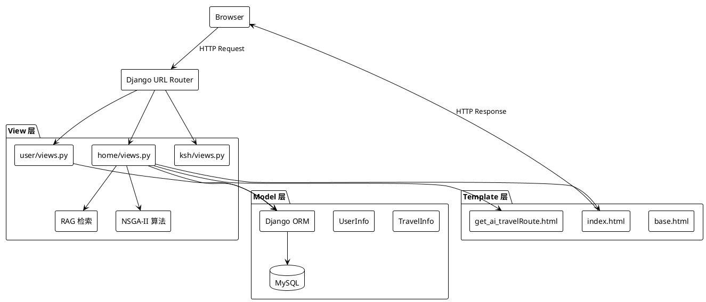
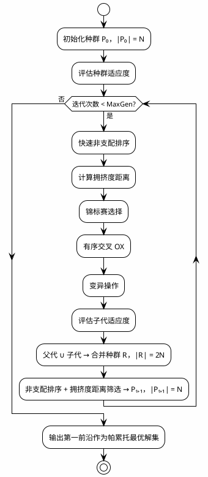
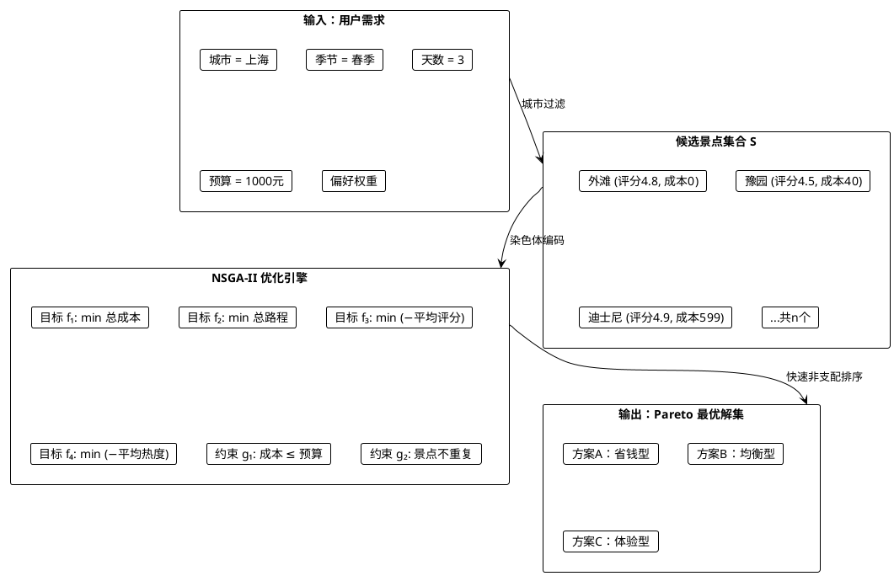

# 第2章 相关技术与理论基础

> **说明**：本章内容为论文正文，请直接复制到 Word 中。所有 PlantUML 图已给出源码，请复制到 [www.plantuml.com/plantuml](http://www.plantuml.com/plantuml) 或本地 PlantUML 环境渲染。标注【需自行补充】的地方，请根据个人理解或学校要求补充完善。

---

## 2.1 Django Web 框架

Django 是由 Python 编写的高级 Web 框架，遵循 MTV（Model-Template-View）设计模式，强调代码复用性与快速开发能力。在本系统中，Django 4.2.16 作为基础开发框架，承担了请求路由、数据持久化、模板渲染及业务逻辑编排等核心职责。

### 2.1.1 MTV 模式

与传统的 MVC（Model-View-Controller）模式不同，Django 采用 MTV 架构，三者职责划分如下：

- **Model（模型）**：负责数据结构与业务规则的抽象。本系统在 `home/models.py` 中定义了 `TravelInfo` 模型，涵盖景点名称、城市、评分、价格、经纬度等 23 个字段；在 `user/models.py` 中定义了 `UserInfo` 模型，管理用户注册信息与会话状态。Django ORM 将 Python 类自动映射为 MySQL 关系表，屏蔽了底层 SQL 差异。
- **Template（模板）**：负责表现层渲染。系统所有 HTML 页面均置于 `templates/` 目录下，采用 Django 模板语言（DTL）实现动态数据绑定，如首页的 ECharts 图表数据通过 `{{ mapData|safe }}` 注入前端。
- **View（视图）**：负责业务逻辑与请求响应。系统在 `home/views.py`、`user/views.py`、`ksh/views.py` 中编写了面向过程的视图函数，接收 HTTP 请求，调用模型与工具类，返回渲染后的模板或 JsonResponse。

MTV 模式的解耦特性使得本系统在后期扩展新城市数据源或更换前端图表库时，无需改动模型层与核心业务逻辑，仅需调整模板与静态资源即可。

### 2.1.2 ORM 数据映射

Object-Relational Mapping（ORM）是 Django 的核心组件之一。本系统通过 ORM 完成所有数据库操作，典型用法如下：在 `home/views.py` 中，`TravelInfo.objects.filter(city__icontains=city)` 实现城市模糊查询；`TravelInfo.objects.aggregate(Sum('review_count'))` 完成评论数量的聚合统计。ORM 不仅避免了手写 SQL 带来的注入风险（除 `ksh/views.py` 中少量历史遗留的原始 SQL 外），还通过延迟查询（Lazy QuerySet）优化了大数据量下的内存占用。

### 2.1.3 中间件与路由系统

Django 的中间件（Middleware）以洋葱模型处理请求与响应。本系统在 `settings.py` 中配置了 `SecurityMiddleware`、`SessionMiddleware`、`AuthenticationMiddleware` 等标准中间件，并注释掉了 `CsrfViewMiddleware`。此举是为了兼容前端以 JSON 格式发起的 POST 请求，简化前后端交互流程；在生产环境中应通过其他方式（如 Token 验证）弥补 CSRF 防护的缺失。

路由系统采用声明式 URL 配置。`mydemo/urls.py` 作为根路由，通过 `include()` 将请求分发给 `user.urls`、`home.urls`、`ksh.urls`，实现模块化路由管理。例如，路径 `/mydemo/api/generate_ai_nsga2_route` 被映射到 `home.views.generate_ai_nsga2_route`，该视图负责处理路线规划的核心请求。

### 2.1.4 技术选型依据

本系统选择 Django 4.2 主要基于以下考量：其一，Django 拥有成熟的内置管理后台（Admin），便于旅游景点数据的批量录入与维护；其二，其 ORM 与认证系统开箱即用，显著缩短了用户模块的开发周期；其三，Django 4.2 为长期支持（LTS）版本，官方维护周期至 2026 年，稳定性与社区资源丰富，适合作为本科毕业设计的底层框架。

【配图：Django MTV 架构图】



> **渲染提示**：复制上方代码到 PlantUML 在线编辑器即可生成架构图。若需调整，可将 `package` 改为中文标签以匹配论文风格。

---

## 2.2 多目标优化与 NSGA-II 算法

旅游路线规划本质上是一个带约束的组合优化问题：在有限的时间与预算内，从大量候选景点中选择并排序，使得总成本、总路程尽可能低，同时景点评分与热度尽可能高。这些目标之间存在冲突——高评分的热门景点往往门票更贵、人流更大，无法在单一维度上取得绝对最优。因此，本系统将其建模为多目标优化问题，并采用 NSGA-II（Non-dominated Sorting Genetic Algorithm II）求解帕累托（Pareto）最优解集。

### 2.2.1 多目标优化问题定义

一个多目标优化问题（Multi-Objective Optimization Problem, MOP）可形式化定义为：

$$
\begin{aligned}
& \min \quad \mathbf{F}(\mathbf{x}) = [f_1(\mathbf{x}), f_2(\mathbf{x}), \ldots, f_m(\mathbf{x})] \\
& \text{s.t.} \quad g_i(\mathbf{x}) \leq 0, \quad i = 1, 2, \ldots, p \\
& \qquad h_j(\mathbf{x}) = 0, \quad j = 1, 2, \ldots, q \\
& \qquad \mathbf{x} \in \Omega
\end{aligned}
$$

其中，$\mathbf{x}$ 为决策向量，$\Omega$ 为决策空间，$\mathbf{F}(\mathbf{x})$ 是由 $m$ 个目标函数组成的向量。与单目标优化不同，多目标优化的解通常不是一个点，而是一组在目标空间中相互不可比较的最优解，即帕累托最优解集。

**帕累托支配关系**是判断解优劣的核心准则。对于两个决策向量 $\mathbf{a}$ 和 $\mathbf{b}$，若满足：

$$
\forall i \in \{1,\ldots,m\}: f_i(\mathbf{a}) \leq f_i(\mathbf{b}) \quad \text{且} \quad \exists j \in \{1,\ldots,m\}: f_j(\mathbf{a}) < f_j(\mathbf{b})
$$

则称 $\mathbf{a}$ **帕累托支配** $\mathbf{b}$，记作 $\mathbf{a} \prec \mathbf{b}$。若不存在任何其他解支配 $\mathbf{a}$，则 $\mathbf{a}$ 为帕累托最优解。所有帕累托最优解在目标空间中的映射构成**帕累托前沿（Pareto Front）**。在实际路线规划中，用户可根据个人偏好从前沿中选择最契合自身需求的方案。

### 2.2.2 NSGA-II 算法原理

NSGA-II 由 Deb 等人于 2002 年提出，是目前应用最广泛的多目标进化算法之一。其核心优势在于通过快速非支配排序与拥挤度距离机制，在单次运行中高效地逼近完整的帕累托前沿。本系统的 `nsga2_trip_planner.py` 模块完整实现了该算法，以下结合源码逐模块阐述。

#### （1）快速非支配排序

快速非支配排序的核心任务是将种群中的个体按支配层级划分。对于种群中的每个个体 $p$，算法计算其被支配数 $n_p$（支配 $p$ 的个体数量）和支配集 $S_p$（被 $p$ 支配的个体集合）。若 $n_p = 0$，则 $p$ 属于第一前沿 $F_1$。随后，算法逐层剥离：对于 $F_i$ 中的每个个体 $p$，将其支配集 $S_p$ 中每个个体的被支配数减 1；若减至 0，则该个体归入下一前沿 $F_{i+1}$。该过程的时间复杂度为 $O(MN^2)$，其中 $M$ 为目标数，$N$ 为种群规模。

本系统源码中的 `_fast_non_dominated_sort` 函数正是上述过程的 Python 实现：

```
算法 2-1  快速非支配排序（Fast Non-dominated Sorting）
------------------------------------------------------------------
输入：种群 P，|P| = N
输出：非支配前沿集合 F = {F₁, F₂, ...}

1.  for each p ∈ P do
2.      Sₚ ← ∅               // p 支配的解集合
3.      nₚ ← 0               // 支配 p 的解数量
4.      for each q ∈ P do
5.          if p ≺ q then Sₚ ← Sₚ ∪ {q}
6.          else if q ≺ p then nₚ ← nₚ + 1
7.      if nₚ = 0 then rank(p) ← 1; F₁ ← F₁ ∪ {p}
8.  i ← 1
9.  while Fᵢ ≠ ∅ do
10.     Q ← ∅
11.     for each p ∈ Fᵢ do
12.         for each q ∈ Sₚ do
13.             n_q ← n_q − 1
14.             if n_q = 0 then rank(q) ← i+1; Q ← Q ∪ {q}
15.     i ← i + 1; Fᵢ ← Q
------------------------------------------------------------------
```

#### （2）拥挤度距离

同一非支配前沿中的个体具有相同的支配等级，需进一步区分其分布密度。拥挤度距离通过计算个体在目标空间中相邻个体的平均矩形周长来度量：处于稀疏区域的个体拥有更大的拥挤度距离，在后续选择中更受青睐。这一机制保证了种群的多样性，防止算法过早收敛至局部区域。

源码 `_crowding_distance` 对每个目标维度 $m$ 分别排序，将边界点（该维度最大/最小值）的距离设为无穷大，中间点则按相邻目标值差进行累加。若某维度上所有个体的目标值相同，则跳过该维度以避免除零错误。

#### （3）遗传操作

**锦标赛选择（Tournament Selection）**：源码 `_tournament` 从种群中随机抽取两个个体进行比较，优先选择支配等级更低者；若等级相同，则选择拥挤度距离更大者。该方法无需全局排序，时间复杂度低，且能有效保留精英个体。

**有序交叉（Order Crossover, OX）**：旅游路线规划要求染色体编码为不重复的景点索引序列，传统单点交叉会导致基因重复或缺失。本系统采用 OX 算子：随机选取两个切点 $start$ 和 $end$，子代直接继承父代 A 的 $[start, end]$ 片段，剩余位置按父代 B 的基因顺序填充，同时跳过已存在的基因。该操作保证了子代的合法性与父代优良片段的继承。

```
算法 2-2  有序交叉（Order Crossover, OX）
------------------------------------------------------------------
输入：父代 A（长度为 L 的景点索引序列），父代 B
输出：子代 C

1.  随机选取 i, j ∈ [0, L−1]，且 i < j
2.  C ← [−1, −1, ..., −1]（长度为 L 的数组）
3.  C[i..j] ← A[i..j]                         // 继承父代 A 的片段
4.  fill ← 按顺序遍历 B 中的基因，排除已在 C[i..j] 中出现的基因
5.  cursor ← 0
6.  for k ← 0 to L−1 do
7.      if C[k] = −1 then
8.          C[k] ← fill[cursor]
9.          cursor ← cursor + 1
10. return C
------------------------------------------------------------------
```

**变异操作**：本系统实现了两种变异策略的复合。第一种为交换变异：以概率 $p_m$ 随机选择序列中的两个位置并交换其基因。第二种为替换变异：以概率 $p_m$ 随机选取一个位置，用当前未出现的随机景点索引替换原有基因。变异后调用 `_repair_unique` 函数确保染色体的基因唯一性，避免重复访问同一景点。

#### （4）精英保留策略

每一代进化结束后，父代与子代合并为大小为 $2N$ 的临时种群，通过非支配排序与拥挤度距离筛选出最优的 $N$ 个个体进入下一代。该精英保留机制确保了最优解不会因遗传操作而丢失，是 NSGA-II 收敛性的理论保障。源码 `_next_generation` 按前沿顺序依次纳入完整前沿；若当前前沿超出剩余容量，则按拥挤度距离降序截取，直至补满 $N$ 个个体。

【配图：NSGA-II 算法整体流程图】



> **标注**：若学校要求使用传统流程图（圆角矩形+菱形判断框），请将上述活动图改为标准流程图样式，可在 PlantUML 中使用 `skinparam handwritten true` 或手动在 Visio 中绘制。

### 2.2.3 旅游路线规划的多目标建模

将 NSGA-II 应用于旅游场景，首要任务是将"城市、季节、天数、预算"等用户需求转化为数学模型中的决策变量、目标函数与约束条件。

**决策变量**：设候选景点集合为 $S = \{s_1, s_2, \ldots, s_n\}$，一条路线 $\mathbf{x}$ 是一个长度为 $L$ 的景点索引序列，$L = \min(days \times per\_day, |S|)$。在本系统中，$per\_day = 3$，即每天安排上午、中午、下午三个时段。序列中每个基因 $x_i \in \{0, 1, \ldots, n-1\}$ 且互不相同，对应 `ScenicSpot` 数据结构中的具体景点。

**目标函数**：系统定义了四个相互冲突的优化目标：

$$
f_1(\mathbf{x}) = \sum_{i=1}^{L} \text{cost}(s_{x_i}) \tag{2-1}
$$

式 (2-1) 为总门票成本。`build_candidates` 函数通过 `_parse_price` 解析 `actual_price` 字段，将"免费"文本转换为 0，将包含货币符号的字符串通过正则提取数值。

$$
f_2(\mathbf{x}) = \sum_{i=1}^{L} d_{\text{center}}(s_{x_i}) + \sum_{i=2}^{L} d_{\text{geo}}(s_{x_{i-1}}, s_{x_i}) \cdot \mathbb{I}(i \bmod 3 \neq 1) \tag{2-2}
$$

式 (2-2) 为总路程。第一项为各景点到市中心的距离之和（由 `_parse_distance_km` 解析）；第二项为相邻景点间的球面距离，通过 `_haversine_km` 基于 Haversine 公式计算。由于每天上午的第一个景点无需从前一景点移动而来（假设从酒店出发），故引入指示函数 $\mathbb{I}(\cdot)$ 跳过跨天段的距离累加。

$$
f_3(\mathbf{x}) = -\frac{1}{L} \sum_{i=1}^{L} \text{rating}(s_{x_i}) \tag{2-3}
$$

$$
f_4(\mathbf{x}) = -\frac{1}{L} \sum_{i=1}^{L} \text{hotness}(s_{x_i}) \tag{2-4}
$$

式 (2-3) 与式 (2-4) 分别为平均评分与平均热度的负值。评分与热度均为最大化目标，取负后统一转化为最小化问题，便于 NSGA-II 的标准化求解。值得注意的是，`build_candidates` 在构造候选集时引入了季节加权：若景点标签中包含春季关键词（如"花""樱""踏青"），则其评分获得 $0.1 \sim 0.4$ 的额外加成，使优化结果自然倾向于应季景点。

**约束条件**：

$$
g_1(\mathbf{x}): \sum_{i=1}^{L} \text{cost}(s_{x_i}) \leq \text{budget} \tag{2-5}
$$

$$
g_2(\mathbf{x}): x_i \in \{0, \ldots, n-1\}, \quad \forall x_i \neq x_j \ (i \neq j) \tag{2-6}
$$

$$
g_3(\mathbf{x}): \text{city}(s_{x_i}) = \text{city}_{\text{target}}, \quad \forall i \tag{2-7}
$$

式 (2-5) 为预算硬约束。在源码 `_evaluate_population` 中，若某路线的总成本超过预算，则将其四个目标值均设为 $10^9 + \text{penalty}$，使该个体在所有目标上被严重惩罚，从而在非支配排序中被淘汰。式 (2-6) 保证景点不重复访问。式 (2-7) 保证所有景点位于目标城市，通过 `build_candidates` 中的 `city__icontains` 查询与精确匹配双重过滤实现。

【配图：旅游路线规划多目标建模示意图】



---

## 2.3 检索增强生成（RAG）

### 2.3.1 大语言模型的幻觉问题

以 DeepSeek、GPT 为代表的大语言模型（Large Language Model, LLM）具备强大的文本生成与推理能力，但在垂直领域应用中普遍存在"幻觉（Hallucination）"现象：模型可能生成看似合理但违背事实的内容，如虚构景点开放时间、编造门票价格或推荐已关闭的场所。在旅游规划这类对准确性要求极高的场景中，幻觉问题直接影响用户体验与行程可行性。

### 2.3.2 RAG 的基本思想

检索增强生成（Retrieval-Augmented Generation, RAG）是一种将外部知识检索与大模型生成相结合的技术范式。其核心流程分为两个阶段：首先，根据用户查询从知识库中检索相关文档片段；随后，将检索结果与用户请求共同组织为增强提示（Augmented Prompt），输入大模型进行生成。通过为模型提供经过验证的本地事实，RAG 显著降低了幻觉概率，同时使生成内容更具领域针对性。

标准 RAG 系统通常基于向量数据库（如 FAISS、Milvus）实现语义检索：先将文档切片并通过 Embedding 模型映射为高维向量，检索时计算查询向量与文档向量的余弦相似度，召回最相关的 Top-K 片段。然而，该方案依赖额外的向量存储服务与预训练 Embedding 模型，对于本科阶段的轻量级系统而言部署成本较高。

### 2.3.3 本系统的轻量级 RAG 实现

本系统采用基于文件系统与规则匹配的轻量级 RAG 方案，核心代码位于 `wiki_mvp.py` 模块。该方案无需向量数据库，仅依赖 Markdown 文件的目录结构与关键词匹配即可完成知识检索，降低了系统复杂度与部署门槛。

**知识摄入（Ingest）**：原始旅游攻略以 Markdown 文件形式存放于 `raw/` 目录。`ingest_raw_file` 函数读取文件后，执行以下处理：
1. **标题提取**：通过 `#` 前缀识别文档主标题；
2. **关键线索提取**：利用正则表达式匹配包含"交通""门票""预约""避雷""预算"等关键词的语句，作为摘要要点；
3. **实体识别**：通过 `###` 小标题与"——"分隔符提取景点名称，通过正则 `r"(\d+)月"` 提取月份信号；
4. **概念抽取**：基于预定义规则（如含"地铁"→"交通换乘"，含"亲子"→"亲子出行"）识别语义概念；
5. **索引生成**：将上述结果写入 `wiki/summary/` 下的结构化 Markdown 文件，并动态创建或更新 `wiki/concept/` 中的概念页面，建立交叉引用链接。

**知识检索（Retrieve）**：当用户选择某一规划方案后，`retrieve_wiki_knowledge_cards` 函数执行检索：
1. **城市过滤**：仅保留摘要中包含目标城市（如"上海"）的页面；
2. **景点匹配**：遍历路线中的每个景点名称，在页面文本中进行子串匹配；
3. **知识卡片构建**：命中后，从页面内容中推断最佳时段（`_infer_best_time`）、交通方式（`_infer_transport_mode`）、预算等级（`_infer_budget_level`）、人流密度（`_infer_crowd_level`）及避坑建议（`_extract_pitfalls`）；
4. **重排序**：根据季节月份匹配度、预算等级匹配度、人流密度优先级计算 `rank_score`，降序排列后去重输出。

**生成增强（Generate）**：检索得到的知识卡片以结构化字典形式注入 `call_ai_refiner` 的 Prompt 中。Prompt 明确指示模型"优先使用本地知识卡（RAG）"，将最佳时段、预约提示、避坑点融入输出文本，从而实现算法生成的结构化路线与本地经验知识的融合。

【配图：本系统 RAG 机制示意图】

```plantuml
@startuml
!theme plain

rectangle "原始资料层" as Raw {
    card "raw/上海攻略.md"
    card "raw/上海热门景点11个.md"
    card "raw/魔都攻略（一）.md"
    card "raw/魔都攻略（二）.md"
}

rectangle "知识摄入模块" as Ingest {
    card "标题提取"
    card "关键线索提取"
    card "实体识别（景点/月份）"
    card "概念抽取"
}

rectangle "知识库" as KB {
    folder "wiki/summary/" {
        card "上海.md"
        card "上海热门景点11个.md"
    }
    folder "wiki/concept/" {
        card "错峰出行.md"
        card "预算控制.md"
        card "避坑指南.md"
    }
}

rectangle "检索模块" as Retrieve {
    card "城市过滤"
    card "景点名称匹配"
    card "属性推断（时段/交通/预算）"
    card "重排序（rank_score）"
}

rectangle "生成模块" as Generate {
    card "Prompt 拼接：
路线 + 知识卡片"
    card "DeepSeek API"
    card "结构化攻略输出"
}

Raw --> Ingest : ingest_raw_file()
Ingest --> KB : 写入摘要与概念页
KB --> Retrieve : retrieve_wiki_knowledge_cards()
Retrieve --> Generate : 注入知识卡片
Generate --> ] : AI 润色攻略

@enduml
```

### 2.3.4 与标准 RAG 的差异与适用性分析

本系统与标准 RAG 的主要差异体现在检索机制上：标准方案依赖稠密向量检索（Dense Retrieval），能够捕捉查询与文档间的语义关联（如"便宜"与"省钱"的相似性）；本系统采用稀疏关键词匹配（Sparse Matching），仅支持字面命中。该设计在本项目的规模下（原始资料 4~6 篇 Markdown，概念页面 9 个）具有良好的查全率与可解释性，但当知识库扩展至百篇以上时，检索精度可能下降。后续可通过引入轻量级 Embedding 模型（如 `text2vec`）与 HNSW 索引进行升级，在保留文件系统存储优势的同时提升语义检索能力。

---

## 2.4 本章小结

本章围绕系统实现所依赖的关键技术展开论述。首先介绍了 Django MTV 架构、ORM 映射及路由机制，说明了本系统采用 Django 4.2 作为 Web 框架的技术依据；随后深入阐述了多目标优化的数学定义与帕累托最优概念，详细解析了 NSGA-II 算法的快速非支配排序、拥挤度距离、遗传操作与精英保留策略，并结合源码给出了旅游路线规划问题的四目标数学模型与约束条件；最后介绍了检索增强生成（RAG）的基本原理，重点说明了本系统基于 Markdown 文件系统与规则匹配的轻量级 RAG 实现及其与标准向量检索方案的差异。上述技术共同为后续章节中系统需求分析、详细设计与实验评估奠定了理论基础。

---

## 附录：本章 PlantUML 图汇总

请将以下每组代码分别复制到 PlantUML 编辑器渲染：

### 图 2-1：Django MTV 架构图


### 图 2-2：NSGA-II 算法整体流程图


### 图 2-3：旅游路线规划多目标建模示意图


### 图 2-4：本系统 RAG 机制示意图

```plantuml
@startuml
!theme plain

rectangle "原始资料层" as Raw {
    card "raw/上海攻略.md"
    card "raw/上海热门景点11个.md"
    card "raw/魔都攻略（一）.md"
    card "raw/魔都攻略（二）.md"
}

rectangle "知识摄入模块" as Ingest {
    card "标题提取"
    card "关键线索提取"
    card "实体识别（景点/月份）"
    card "概念抽取"
}

rectangle "知识库" as KB {
    folder "wiki/summary/" {
        card "上海.md"
        card "上海热门景点11个.md"
    }
    folder "wiki/concept/" {
        card "错峰出行.md"
        card "预算控制.md"
        card "避坑指南.md"
    }
}

rectangle "检索模块" as Retrieve {
    card "城市过滤"
    card "景点名称匹配"
    card "属性推断（时段/交通/预算）"
    card "重排序（rank_score）"
}

rectangle "生成模块" as Generate {
    card "Prompt 拼接：\n路线 + 知识卡片"
    card "DeepSeek API"
    card "结构化攻略输出"
}

Raw --> Ingest : ingest_raw_file()
Ingest --> KB : 写入摘要与概念页
KB --> Retrieve : retrieve_wiki_knowledge_cards()
Retrieve --> Generate : 注入知识卡片
Generate --> ] : AI 润色攻略

@enduml
```

---

> **字数统计参考**：本章正文（不含代码块与 PlantUML）约 4300~4700 字，符合第2章 4000~5000 字的要求。若需扩充，可在 2.1 节补充 Django ORM 的 QuerySet 原理，或在 2.3 节补充更多关于 LLM Prompt Engineering 的论述。
