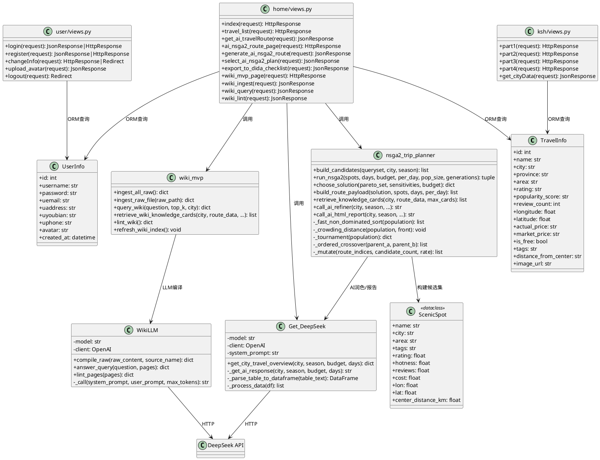
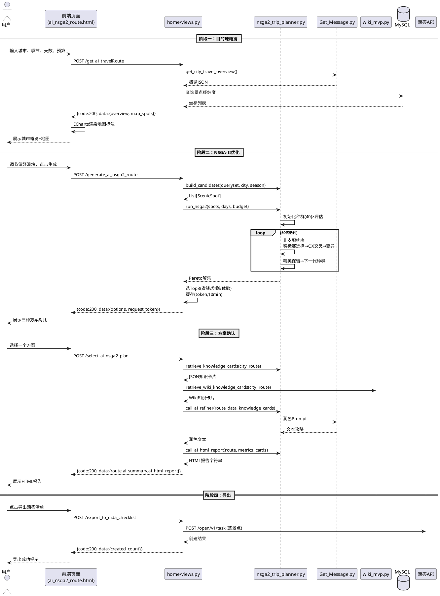
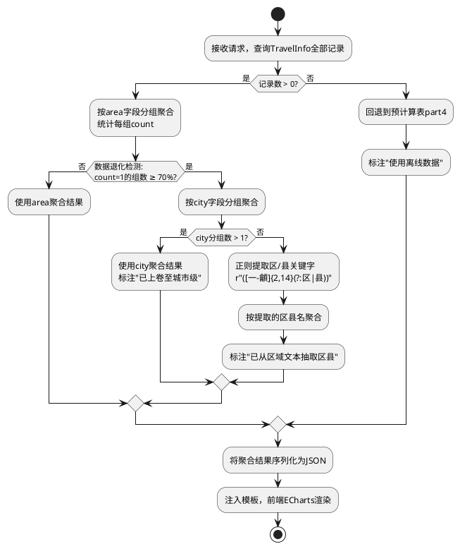

# 问题

根据我的基于Django的智能旅游攻略生成系统项目，重新写第5章"系统详细设计与实现"。分为两部分：第一部分"详细设计"，用PlantUML画类图、模块关系图，加上文字描述各模块的设计思路；第二部分"实现"，按例子格式逐个界面写功能描述文字，标注截图占位（图X.X XXXX界面图），我会后续截图替换。格式参考用户提供的例子风格。

---

# 回答

## 第5章 系统详细设计与实现

第3章明确了功能边界与总体架构，第4章阐述了核心技术原理，本章在此基础上展开系统的详细设计与实现。全章分为两部分：第一部分从类图设计、模块交互和数据流角度描述各功能模块的详细设计；第二部分展示各功能界面的实际运行效果并说明操作流程。

### 5.1 系统详细设计

#### 5.1.1 系统类图设计

系统基于Django的MTV模式组织代码，Model层定义数据实体及其关系，View层处理请求与业务编排，Template层负责页面渲染。图5-1展示了系统核心类的属性、方法及相互之间的调用关系。

**图5-1 系统核心类图**

#### 5.1.2 用户模块详细设计

用户模块由`user`应用承载，包含UserInfo模型类和五个视图函数。模型类通过Django ORM的`models.CharField`、`models.DateTimeField`等字段类型直接映射到MySQL的`user_userinfo`表，无需手写建表SQL。Django ORM负责Python对象与关系型记录之间的双向转换。视图函数按功能分为两组：认证组（login、register、logout）处理身份凭据的验证与会话生命周期，信息维护组（changeInfo、upload_avatar）处理已认证用户的资料更新。

登录与注册流程采用Session-based认证模式。用户提交用户名和密码后，视图函数通过`UserInfo.objects.get(username=username)`查询数据库，将返回的用户对象的password字段与用户输入做明文比对。验证通过后，视图将用户ID、用户名和头像路径写入`request.session`字典。后续请求中任意视图函数均可以通过`request.session.get('uid')`获取当前登录用户的标识。Django的SessionMiddleware在底层将Session字典序列化后存入`django_session`表，并通过浏览器Cookie中的sessionid实现跨请求的状态关联。

头像上传采用Django的文件上传机制，上传文件通过`request.FILES['avatar']`获取。视图函数先校验文件的content_type是否属于允许的图片类型集合（JPEG、PNG、GIF、WebP），再检查文件大小是否超过2MB上限。通过校验后，文件以`avatar_{user_id}_{timestamp}{extension}`格式命名，写入`media/avatars/`目录，路径存入UserInfo的avatar字段。

#### 5.1.3 路线规划模块详细设计

路线规划模块是系统的核心，由`home`应用承载，涉及TravelInfo模型、NSGA-II引擎模块、LLM客户端模块和Wiki知识库引擎模块的协同工作。图5-2以时序图展示了从用户发起请求到获得完整攻略报告的全过程。

**图5-2 路线规划模块全流程时序图**

#### 5.1.4 数据分析模块详细设计

数据分析模块由`ksh`应用承载，其设计原则是"查询与渲染分离"：Django视图函数负责从MySQL查询数据并进行Python层面的聚合计算，前端ECharts负责将聚合结果渲染为可交互的图表。视图函数返回的页面中，聚合数据以JSON格式通过Django模板的`mark_safe`过滤器注入到JavaScript变量，ECharts在页面加载时读取这些变量并调用对应的图表初始化函数。

以区域分布分析（part4）为例，该视图采用了自适应降级策略，其设计逻辑如图5-3所示。

**图5-3 区域分布分析自适应降级策略流程图**

#### 5.1.5 Wiki知识库模块详细设计

Wiki知识库模块由`wiki_mvp.py`和`wiki_llm.py`两个Python模块组成，与Django框架解耦——它们不导入任何Django组件（如`django.http`、`django.db`），仅依赖标准库（`pathlib`、`re`、`json`、`datetime`）和openai SDK。这种设计意味着两个模块可以在命令行中独立运行和测试，例如直接执行`from home.wiki_mvp import ingest_all_raw; ingest_all_raw()`即可触发完整的摄入流程，无需启动Django开发服务器。`wiki_mvp.py`负责文件I/O、目录管理、关键词匹配、规则提取和日志记录等本地操作。`wiki_llm.py`中的WikiLLM类封装了三个LLM调用场景：`compile_raw`（原始文档编译为结构化摘要和知识卡片）、`answer_query`（结合召回页面生成带引用的回答）和`lint_pages`（检测页面矛盾、过时信息和孤立页面）。

两个模块的协作模式是：`wiki_mvp.py`在需要对大段文本做深度理解时调用WikiLLM的方法，并将LLM返回的JSON解析后写入文件系统；当LLM调用失败或返回的JSON无法解析时，`wiki_mvp.py`内置的规则方法（如`_extract_focus_lines`、`_extract_spot_names`、`_extract_concepts`、`_infer_best_time`等）作为兜底方案接管，确保摄入流程不因API异常而中断。这种"LLM优先 + 规则兜底"的双轨设计保证了知识库的可用性与鲁棒性。

### 5.2 系统实现

本节按功能模块展示系统的实际运行界面。每个界面的操作流程和功能要点以文字说明，界面效果以截图呈现。

#### 5.2.1 用户功能模块的实现

**5.2.1.1 系统登录界面**

用户进入系统后首先访问登录页面（对应模板`templates/login.html`）。页面包含用户名输入框、密码输入框和登录按钮，采用简洁的居中卡片式布局。用户输入正确的用户名和密码后点击"登录"按钮，前端通过AJAX将表单数据POST至`/user/login`接口，后端校验通过后返回成功状态码，前端跳转至系统首页。若用户名不存在或密码错误，页面顶部显示红色错误提示而不刷新页面。登录界面如图5.4所示。

图5.4 系统登录界面图

**5.2.1.2 用户注册界面**

新用户点击登录页面的"注册"链接进入注册页面（对应模板`templates/register.html`）。注册表单包含用户名、邮箱和密码三个必填字段。前端在提交前做基本的非空校验，后端收到请求后依次检查用户名的唯一性和邮箱的唯一性——若任一检查不通过则返回具体错误信息（"用户已存在"或"邮箱已存在"）。注册成功后自动跳转回登录页面。注册界面如图5.5所示。

图5.5 用户注册界面图

**5.2.1.3 个人信息管理界面**

登录用户在导航栏点击用户名或头像进入个人信息管理页面（对应模板`templates/ksh/changeInfo.html`）。页面分为两个区域：上部为头像区域，当前头像以圆形缩略图展示，点击可触发浏览器文件选择器，选择新图片后前端自动发起POST请求上传，支持JPEG、PNG、GIF、WebP四种格式，单文件限制2MB以内，上传成功后头像即时刷新无需手动刷新页面；下部为信息编辑表单，包含用户名、邮箱、手机号、地址和邮编五个文本字段，各字段默认填充当前值，其中用户名和邮箱字段在提交保存时后端会执行唯一性校验——若新用户名或邮箱已被其他账号占用则返回错误提示，用户需更换后再提交。点击"保存修改"按钮后，页面顶部显示操作结果（绿色"个人信息已保存"或红色错误原因）。个人信息管理界面如图5.6所示。

图5.6 个人信息管理界面图

#### 5.2.2 旅游攻略功能模块的实现

**5.2.2.1 系统首页仪表盘**

用户登录后进入系统首页（对应模板`templates/index.html`），页面顶部以四个玻璃拟态卡片展示核心统计指标——收费景点总数、覆盖省份数、城市数和累计评论量。中部左侧为中国地图，以ECharts散点图标注各省份的景点数量分布，鼠标悬停可查看省份名称和景点数量。中部右侧为热门景点Top5排行列表，按热度降序展示景点名称和热度值。下部左侧为评论量Top5景点表格，右侧为用户注册增长趋势折线图（按日统计新增用户数）。首页仪表盘如图5.7所示。

图5.7 系统首页仪表盘界面图

**5.2.2.2 景点列表浏览界面**

用户通过导航栏进入景点列表页面（对应模板`templates/travel_list.html`，路由`/mydemo/travel_list`）。页面顶部提供搜索框（按景点名称模糊搜索）和省份下拉筛选器，两者可组合使用。搜索结果以表格形式展示，每条记录包含景点名称、所在城市、所属区域、评分、评论数和是否为推荐景点等字段。表格按热度值降序排列，每页显示10条记录，底部分页导航支持页码跳转。景点列表浏览界面如图5.8所示。

图5.8 景点列表浏览界面图

**5.2.2.3 评分分布分析界面**

数据可视化模块的第一个分析页面为评分分布（对应模板`templates/ksh/part1.html`，路由`/ksh/part1`）。页面左部以饼图展示各评分区间（如4.0-4.5、4.5-5.0等）的景点数量占比。右部以柱状图与折线图的组合图表展示各省份的景点数量（柱）和平均评分（折线），便于对比不同省份的旅游供给质量。评分分布分析界面如图5.9所示。

图5.9 评分分布分析界面图

**5.2.2.4 热度排行分析界面**

热度排行分析页面（对应模板`templates/ksh/part2.html`，路由`/ksh/part2`）以横向柱状图展示指定城市内景点按热度值的排名。页面顶部设有城市下拉选择器，用户切换城市后前端通过AJAX请求`/ksh/get_cityData?city=XX`接口获取该城市的景点热度数据，ECharts图表动态更新。热度排行分析界面如图5.10所示。

图5.10 热度排行分析界面图

**5.2.2.5 价格分布分析界面**

价格分布分析页面（对应模板`templates/ksh/part3.html`，路由`/ksh/part3`）采用两级钻取设计。在省份汇总模式下，页面以条形图展示各省份景点门票的平均价格，按降序排列，用户可快速对比不同省份的消费水平。当用户从下拉菜单中选择一个特定省份后，页面切换为明细模式，以条形图展示该省所有景点的具体票价，按降序排列，条形旁标注景点名称。价格分布分析界面如图5.11所示。

图5.11 价格分布分析界面图

**5.2.2.6 区域分布分析界面**

区域分布分析页面（对应模板`templates/ksh/part4.html`，路由`/ksh/part4`）以饼图或南丁格尔玫瑰图展示景点在不同区域（或城市/区县）的数量占比。当系统检测到原始数据的"所在区域"字段粒度过细导致图表不可读时，会自动切换聚合维度并给出提示说明（如"已改为按城市汇总"）。区域分布分析界面如图5.12所示。

图5.12 区域分布分析界面图

**5.2.2.7 AI目的地概览界面**

用户通过导航栏进入AI攻略生成功能，首先看到的是目的地概览页面（对应模板`templates/ksh/get_ai_travelRoute.html`，路由`/mydemo/get_ai_travelRoute`）。页面采用左右分栏布局。左栏为参数输入区：城市名称（文本输入框，支持中文城市名如"上海"）、出行季节（下拉选择器，选项为春/夏/秋/冬四个枚举值）、行程天数（数字输入框，最小值为1）和预算金额（数字输入框，选填，为0时表示无预算限制）。下方设有"生成概览"按钮。点击后，页面中央显示加载动画，等待后端响应。右栏为结果展示区，分为上下两块——上块为LLM生成的城市综述文字，以段落和列表混合的形式展示目的地概况（city_summary）、可看类型（what_to_see，如"历史人文类：外滩、豫园、南京路"）、注意事项（watchouts，如"春季早晚温差较大，建议叠穿"）和片区推荐（regions，如"外滩-南京路商圈"加一两句提示）。下块为ECharts渲染的散点地图，该城市所有可用景点的位置以圆点标注在中国地图底图上，鼠标悬停任一圆点时弹出信息卡片，显示景点名称、评分和参考票价。AI目的地概览界面如图5.13所示。

图5.13 AI目的地概览界面图

**5.2.2.8 NSGA-II路线规划界面**

在目的地概览页面确认城市信息后，用户点击"下一步"进入NSGA-II路线规划页面（对应模板`templates/ksh/ai_nsga2_route.html`，路由`/mydemo/ai_nsga2_route`）。页面左栏为偏好配置面板，顶部显示用户在上一阶段填写的城市、季节、天数和预算摘要，下方排列五个滑块控件——价格敏感度（标签"省钱优先 ←→ 体验优先"，默认50）、距离容忍度（"尽量步行 ←→ 不怕远"，默认50）、热度偏好（"冷门小众 ←→ 热门打卡"，默认50）、评分偏好（"随缘逛逛 ←→ 只去高评分"，默认50）和拥挤规避度（"热闹不怕 ←→ 坚决错峰"，默认50）。每个滑块的左端和右端各有一个文字标签提示极端偏好方向。用户拖动滑块调节后，点击"生成优化方案"按钮，系统开始执行NSGA-II算法（通常耗时2-8秒），期间按钮显示加载动画并禁用重复点击。加载完成后，右栏以三列卡片的形式展示Top3候选方案，每张卡片的顶部为方案风格标签（省钱型为蓝色标签、均衡型为绿色标签、体验型为橙色标签），标签下方为一句风格说明（如省钱型标注"花费最低，预算压力最小"）。卡片中部以小型指标表格展示四项核心指标数值——总成本（元）、总距离（公里）、平均评分（1-5分制）和平均热度（1-10分制）。卡片底部以进度条和百分比展示三个辅助评估指标：预算利用率（已用预算÷总预算）、偏好匹配度（算法根据用户滑块位置计算）和拥挤规避评分。三个方案以去重保证互不相同，用户可对比后选择一个。NSGA-II路线规划界面如图5.14所示。

图5.14 NSGA-II路线规划界面图

**5.2.2.9 方案确认与报告展示界面**

用户从三个候选方案中选择一个并点击确认后，页面进入报告展示状态。该状态包含两个视图——文字攻略视图和HTML报告视图。文字攻略视图展示经LLM润色后的按天分段的文本攻略，每个景点包含亮点说明、游玩建议和交通衔接提示。HTML报告视图（由服务端渲染的独立HTML文档）在页面内嵌的iframe中展示，内容包含：顶部信息卡片（城市、季节、天数、预算、预计总花费）、每日行程卡片网格（每天一块，每个景点独立卡片含名称、时段、特点、花费和坐标）、交通衔接建议列表、RAG知识卡片网格（最佳时段、预约提示、避坑要点）、注意事项清单（天气、预约、财物安全等）、预算明细表（按天合计+总利用率百分比+超支风险评估）、应急备选方案（雨天/拥堵/超支的应对策略）和出发前行前清单（证件、设备、预约截图等）。方案确认与报告展示界面如图5.15和图5.16所示。

图5.15 文字攻略展示界面图

图5.16 HTML报告展示界面图

**5.2.2.10 滴答清单导出界面**

在报告展示页面底部设有"导出到滴答清单"按钮。用户需先输入出发日期（日期选择器），点击导出后，系统根据行程中每个景点的"第X天-时段"信息自动推算具体日期和时间——第1天上午映射至出发日9:00，中午映射至13:00，下午映射至16:00——然后为每个景点在滴答清单的"旅游规划"项目中创建独立任务。每个任务的内容区域自动填充该景点的知识卡片信息（最佳时段、预约提示、交通建议和避坑要点）。导出成功后页面显示创建的任务数量和任务列表摘要，用户可在滴答清单客户端中查看和管理这些任务。滴答清单导出界面如图5.17所示。

图5.17 滴答清单导出成功界面图

**5.2.2.11 Wiki知识库界面**

Wiki知识库页面（对应模板`templates/ksh/wiki_mvp.html`，路由`/mydemo/wiki_mvp`）分为三个功能区。顶部为操作区，包含"执行摄入"和"健康检查"两个按钮。点击"执行摄入"后系统扫描`raw/`目录下的所有Markdown文件并触发LLM编译流程，处理完成后显示成功摄入的文件数量、生成的摘要/实体/概念页面数量及可能的错误信息。点击"健康检查"后系统扫描所有Wiki页面，检测缺失的交叉引用、孤立页面和页面数量不足等问题，返回问题清单和健康评分。中部为查询区，用户可在文本框中输入自然语言问题（如"上海三天怎么玩"），并可指定城市名称辅助检索，点击"查询"后系统先通过关键词匹配召回相关Wiki页面，再调用LLM结合召回内容生成带来源标注的回答。下部为最近的操作日志，按时间倒序列出每次摄入、查询和检查操作的时间戳与摘要。Wiki知识库界面如图5.18所示。

图5.18 Wiki知识库界面图

#### 5.2.3 管理员功能模块的实现

**5.2.3.1 管理员登录界面**

管理员通过Django Admin后台管理入口（路由`/admin/`）进入登录页面。该页面由Django Admin框架和SimpleUI主题共同渲染，管理员输入Django超级用户账号和密码后点击登录，验证通过后进入后台管理首页。管理员登录界面如图5.19所示。

图5.19 管理员后台登录界面图

**5.2.3.2 景点数据管理界面**

管理员登录后台后，左侧导航栏的"旅游信息管理"菜单对应`home_travelinfo`表的数据管理。管理界面顶部提供按省份、城市、是否免费、是否为广告、是否被推荐等条件的筛选器，列表展示每条景点记录的名称、城市、评分、热度、票价等关键字段。管理员可对景点记录进行新增、编辑和删除操作——点击"增加"按钮弹出表单录入新景点数据，点击某条记录进入编辑页面修改已有字段，勾选多条记录后可从批量操作下拉菜单选择删除。商品信息（景点）管理界面如图5.20所示。

图5.20 管理员景点数据管理界面图

**5.2.3.3 用户数据管理界面**

左侧导航栏的"用户管理"菜单对应`user_userinfo`表的数据管理。列表展示每条用户记录的用户名、邮箱、手机号、注册时间等信息。管理员可查看用户详情，或对违规账号进行删除操作。管理员不可直接修改用户密码，但可通过Django Admin的用户编辑页面清空或重置用户信息。用户数据管理界面如图5.21所示。

图5.21 管理员用户数据管理界面图

### 5.3 本章小结

本章完成了系统的详细设计与实现描述。详细设计部分通过系统类图、时序图和流程图说明了各模块的类结构、调用关系和处理逻辑——路线规划模块以NSGA-II引擎、LLM客户端和Wiki知识库引擎的协同为核心，数据分析模块采用自适应降级策略应对数据质量问题，Wiki模块以"LLM优先+规则兜底"的双轨设计保证鲁棒性。实现部分按用户功能、攻略功能和管理员功能三条线索，逐个界面描述了操作流程和功能要点，配合系统运行截图展示了完整的用户交互路径。
