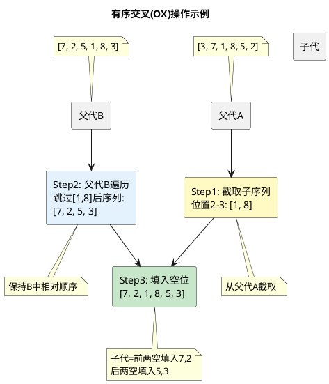

# NSGA-II算法详细实现（第5章补充）

## 算法核心流程

NSGA-II（Non-dominated Sorting Genetic Algorithm II）是本系统路线规划模块的核心优化引擎。算法以候选景点列表为搜索空间，以染色体编码表示景点选择与排列方案，通过快速非支配排序和拥挤距离机制在四个优化目标之间搜索Pareto最优解集。算法整体流程如算法1所示。

**算法1：NSGA-II主流程**

```
输入：候选景点列表 spots，行程天数 days，预算 budget，
      每天景点数 per_day，种群规模 pop_size，迭代代数 generations
输出：Pareto最优解集 pareto_set

 1   route_len = min(days × per_day, |spots|)
 2   种群 P = 随机初始化(pop_size, route_len)
 3   评估种群(P, spots, budget)
 4   for gen = 1 to generations do
 5       前沿集合 F = 快速非支配排序(P)
 6       for each front in F do
 7           拥挤距离计算(P, front)
 8       end for
 9       子代种群 Q = ∅
10       while |Q| < pop_size do
11           父代1 = 锦标赛选择(P)
12           父代2 = 锦标赛选择(P)
13           子代染色体 = 有序交叉(父代1.染色体, 父代2.染色体)
14           子代染色体 = 变异(子代染色体, |spots|)
15           Q = Q ∪ {子代染色体}
16       end while
17       评估种群(Q, spots, budget)
18       合并种群 R = P ∪ Q
19       P = 精英选择(R, pop_size)
20   end for
21   最终前沿 = 快速非支配排序(P)
22   第一前沿可行解 = {x ∈ 最终前沿[0] | feasible(x)}
23   return 第一前沿可行解
```

## 关键算子详解

### 1. 快速非支配排序

快速非支配排序是NSGA-II区别于早期MOEA的核心机制，其计算复杂度为$O(MN^2)$（$M$为目标数，$N$为种群规模）。对种群中的每个个体$p$，维护两个数据结构：$S_p$（被$p$支配的个体集合）和$n_p$（支配$p$的个体数量）。算法首先找出所有$n_p = 0$的个体构成第一前沿$F_1$，随后逐层剥离：遍历$F_i$中每个个体的$S_p$集合，将其中每个$q$的$n_q$减1，当$n_q$降为0时将$q$归入下一前沿$F_{i+1}$。支配关系的判定如式(1)所示。

$$
p \prec q \iff \bigl(\forall i \in \{1,\ldots,M\},\; f_i(p) \leq f_i(q)\bigr) \;\land\; \bigl(\exists j \in \{1,\ldots,M\},\; f_j(p) < f_j(q)\bigr)
\tag{1}
$$

### 2. 拥挤距离

拥挤距离用于衡量同一前沿内个体在目标空间中的局部密度，替代了早期MOEA中需要人工设定的共享参数。对于前沿$F$中的每个个体，拥挤距离为各目标维度上相邻个体归一化距离之和，如式(2)所示。

$$
\text{crowding}(p) = \sum_{m=1}^{M} \frac{f_m(\text{next}_m(p)) - f_m(\text{prev}_m(p))}{f_m^{\max} - f_m^{\min}}
\tag{2}
$$

其中$\text{next}_m(p)$和$\text{prev}_m(p)$分别为按第$m$个目标排序后$p$的前后邻接个体。边界个体（该维度上的最小值或最大值）的拥挤距离设为$+\infty$，确保极端解始终被保留。

### 3. 锦标赛选择

每次从种群中随机抽取两个个体，优先比较非支配排序层级（rank），rank较小者胜出；rank相同时比较拥挤距离，拥挤距离较大者（所处区域更稀疏）胜出。这一机制同时施加收敛压力（趋向低rank）和多样性压力（趋向低密度区域）。

$$
\text{winner} = 
\begin{cases}
p_1, & \text{if } \text{rank}(p_1) < \text{rank}(p_2) \\[4pt]
p_2, & \text{if } \text{rank}(p_2) < \text{rank}(p_1) \\[4pt]
\arg\max(\text{crowding}(p_1), \text{crowding}(p_2)), & \text{if } \text{rank}(p_1) = \text{rank}(p_2)
\end{cases}
\tag{3}
$$

### 4. 有序交叉（Order Crossover, OX）

有序交叉是为排列编码设计的遗传算子，保证子代染色体的合法性（无重复基因）。操作步骤为：(a) 在父代A上随机选取一个连续子序列，直接复制到子代对应位置；(b) 遍历父代B，跳过已出现在子代中的基因，将剩余基因按B中的出现顺序依次填入子代的空位。图1以长度为6的染色体示例说明了该过程。


**图1 有序交叉操作过程示意图**

### 5. 变异算子

变异由两个独立的子操作组成，各自以0.2的概率触发。交换变异随机选取染色体上两个位置并交换其基因值。替换变异随机选取一个位置，从候选景点池中随机抽取一个未在当前染色体中出现的景点索引替换原有基因。每次变异后调用修复函数消除可能的重复基因，保证染色体始终为合法排列。

### 6. 精英选择

合并父代与子代种群（$R = P \cup Q$，规模$2 \times \text{pop\_size}$）后，先对$R$执行快速非支配排序，再按前沿层级从低到高依次选取整层个体进入下一代，直到下一前沿超出剩余名额。对最后一个可部分入选的前沿，按拥挤距离降序截取所需数量。这一机制保证了历代最优个体不会因遗传操作而丢失。

## 算法参数配置

| 参数 | 取值 | 说明 |
|------|------|------|
| pop_size | 40 | 种群规模，过小收敛不足，过大计算成本高 |
| generations | 50 | 迭代代数，实验表明50代后前沿基本稳定 |
| per_day | 3 | 每日景点数量，上午/中午/下午各1个 |
| mutation_rate | 0.2 | 变异概率，平衡探索与利用 |
| budget_penalty | 1e9 | 不可行解惩罚值，远大于正常目标范围 |

## 计算复杂度分析

令$N = \text{pop\_size}$（种群规模），$M = 4$（目标数），$L = \text{days} \times \text{per\_day}$（染色体长度），$G = \text{generations}$（迭代代数）。单次迭代的复杂度主要由非支配排序贡献，为$O(MN^2)$；遗传操作（选择、交叉、变异）为$O(NL)$；适应度评估中Haversine距离计算为$O(NL)$。总复杂度为$O(G \cdot MN^2)$，在本系统参数下（$N=40$，$M=4$，$G=50$），每次优化约需评估$50 \times 4 \times 1600 = 3.2 \times 10^5$次支配比较，运行时间在2-8秒之间，满足实时交互需求。
